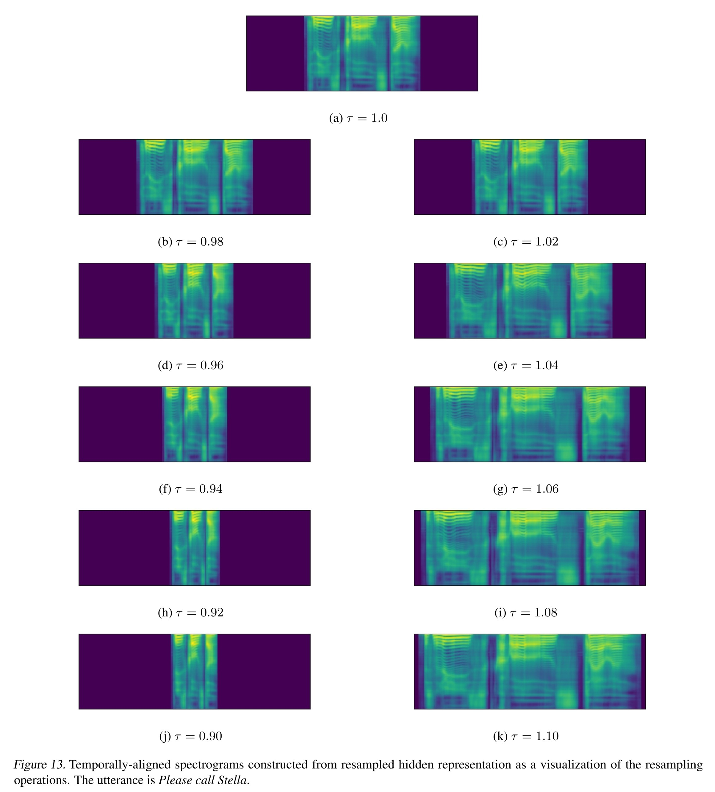

- ## Info
	- tag: #seq2seq #duration #AutoEncoder-Based
	- [source link](https://github.com/auspicious3000/AutoPST)
	- [Global Rhythm Style Transfer Without Text Transcriptions](https://arxiv.org/abs/2106.08519)
	- [demo](https://auspicious3000.github.io/AutoPST-Demo/)
		- 想法有趣，但在語音品質的部分有改善空間
	- previous version: #[[Self-Expressing Autoencoder]] #SpeechSplit
- 目標
	- 更好的抽取韻律、節奏進行 VC
	- 提出基於 Autoencoder 的 **P**rosody **S**tyle **T**ransfer framework
- {:height 468, :width 481}
	-
- {:height 305, :width 481}
- {:height 685, :width 481}
	- 使用 [[Self-Expressing Autoencoder]] 將語音單元分段
- {:height 459, :width 481}
- {:height 207, :width 776}
- {:height 574, :width 776}
- {:height 867, :width 776}
	- 不同的 threshold 對語速會有不同的影響
- ## Resample Algo.
	- $G\sim\mathcal{U}[0.75,1.25]$
	- $\textbf{for}~t=1~\textbf{to}~T~\textbf{do}$
		- $Q\sim\mathcal{U}[G-0.05,G+0.05]$
		- $b_{m+1}\leftarrow t$
		- $\textbf{if}~Q\leq 1$
			- $\tau(t)=Q\text{-}quantile[S(b_m,b_m-20:b_m+20)]$
			- $\textbf{if}~S(b_m,t')<\tau(t),~\forall t\in [t,t+1]$
				- $m\leftarrow m+1$
				- $d_m\leftarrow b_{m+1}-b_m$
		- $\textbf{else}$
			- $\tau(t)=(2-Q)\text{-}quantile[S(b_m,b_m-20:b_m+20)]$
			-
		- $\tau(t)=Q\text{-}quantile[S(b_m,b_m-20:b_m+20)]$
		- $b_{m+1}\leftarrow t$
		- $\textbf{if}~~$
		- $d_m\leftarrow b_{m+1}-b_m$
	- $\textbf{return}~d$