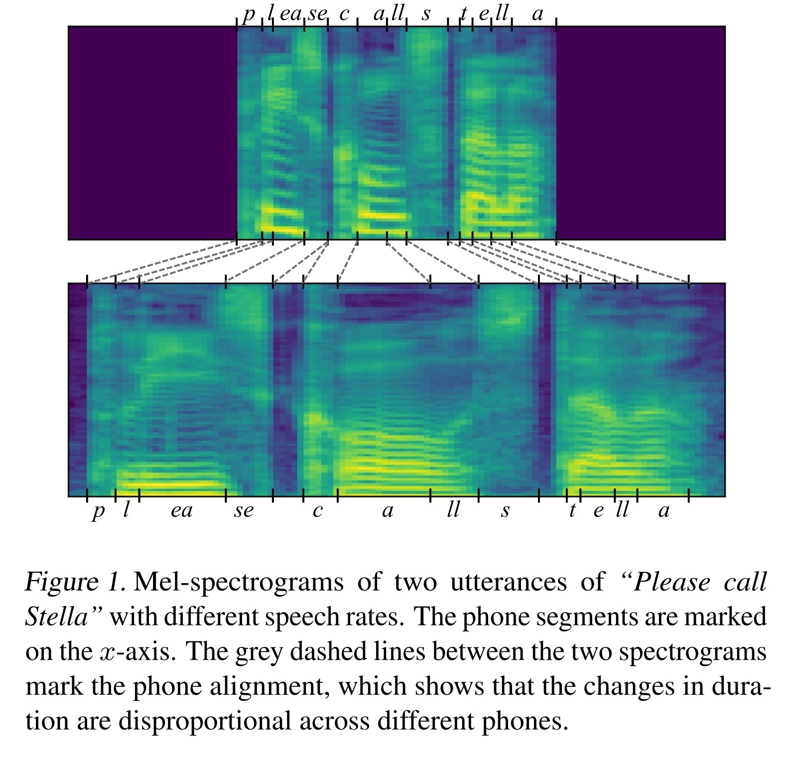
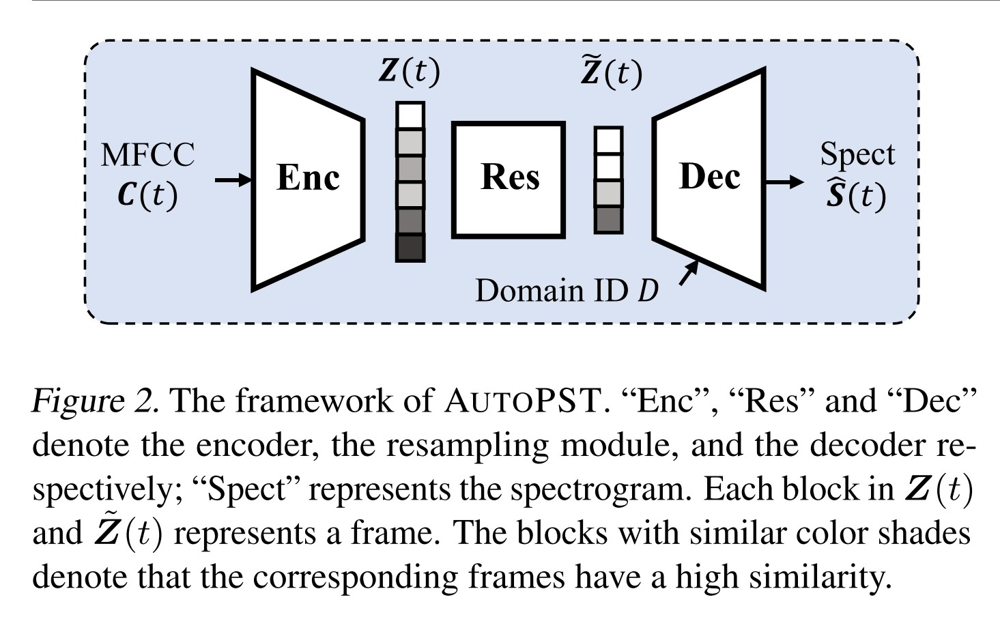
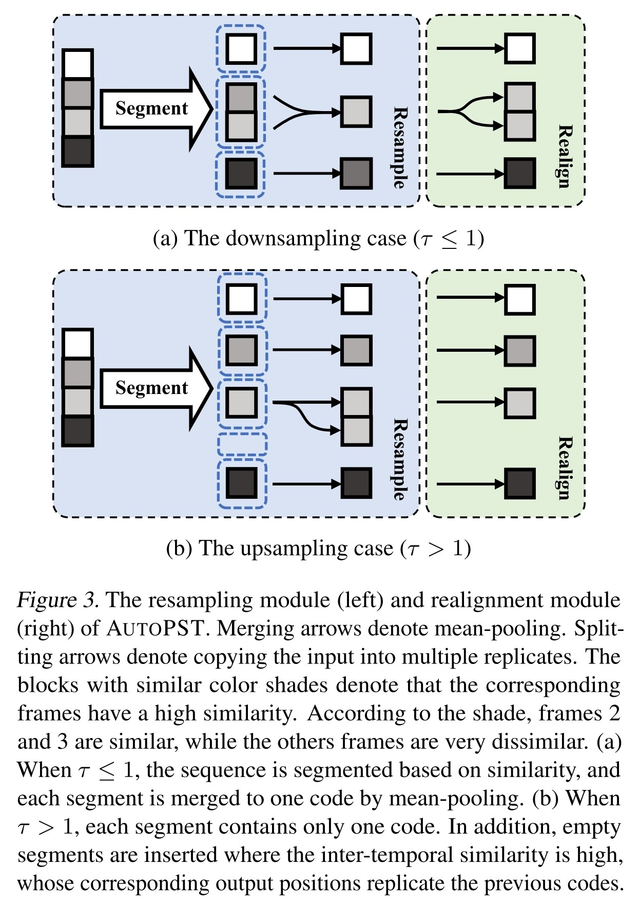
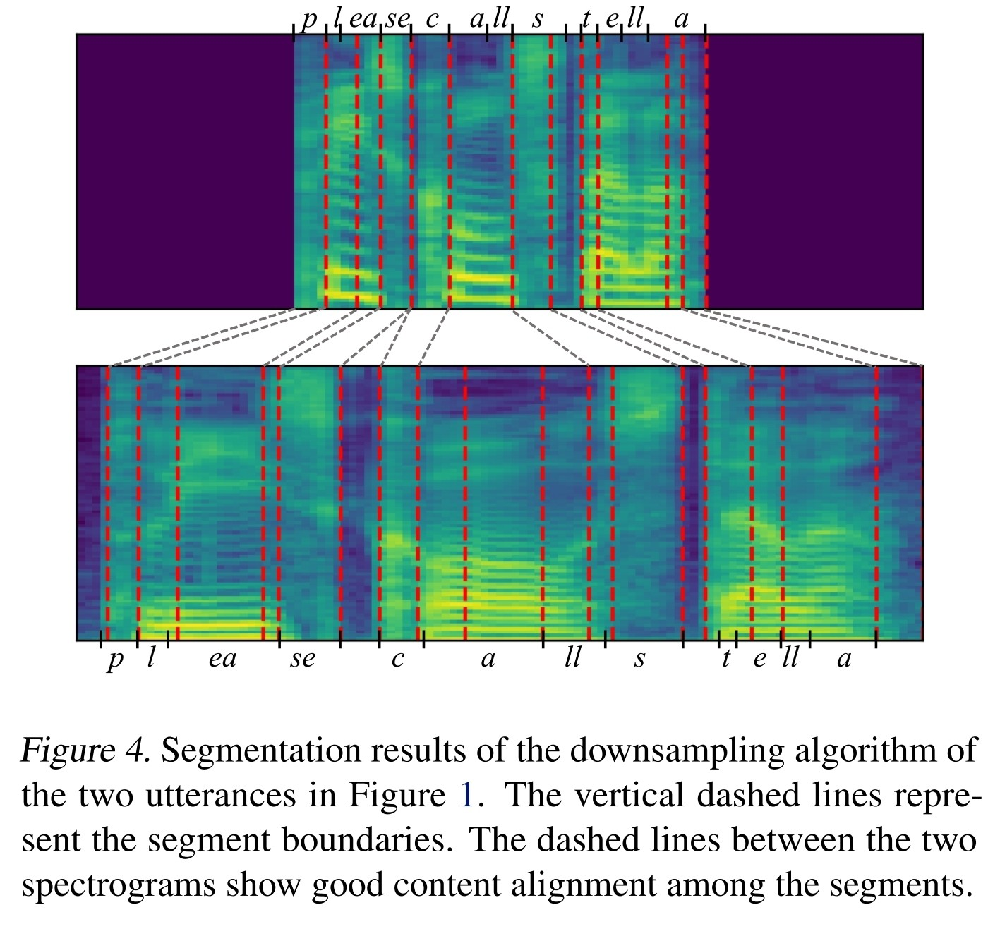
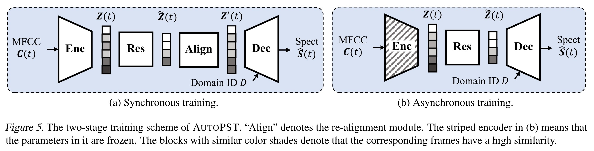
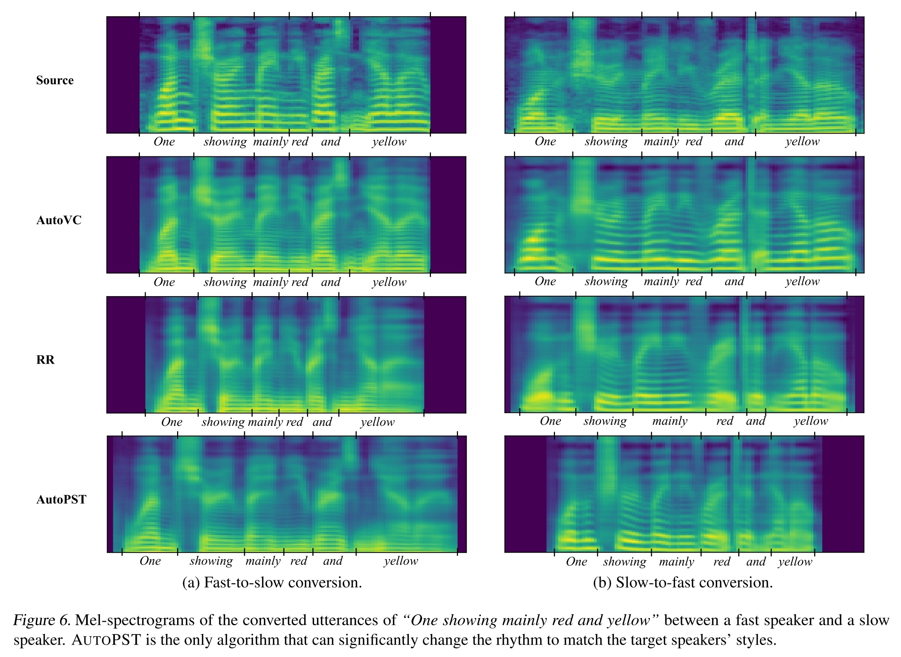

- [source link](https://github.com/auspicious3000/AutoPST)
- [paper link](https://arxiv.org/abs/2106.08519)
- 目標
	- 更好的抽取韻律、節奏進行 VC
	- 提出基於 Autoencoder 的 **P**rosody **S**tyle **T**ransfer framework
- {:height 468, :width 481}
	-
- {:height 305, :width 481}
- {:height 685, :width 481}
- {:height 459, :width 481}
- {:height 207, :width 776}
- {:height 574, :width 776}
-