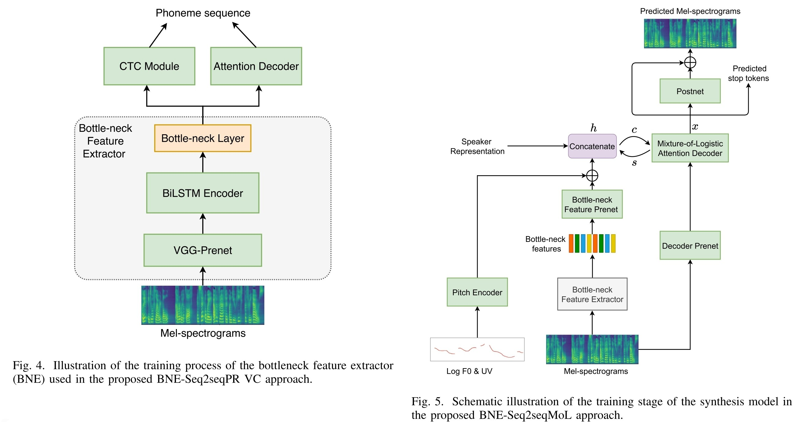

- ## Info
	- tag: #ASR-based #AutoEncoder-based #seq2seq
	- [Any-to-Many Voice Conversion with Location-Relative Sequence-to-Sequence Modeling](https://arxiv.org/abs/2009.02725)
	- [source link](https://github.com/liusongxiang/ppg-vc)
	- [demo](https://liusongxiang.github.io/BNE-Seq2SeqMoL-VC/)
	- previous version: #DurIAN
	- next version:
- [paper link](https://arxiv.org/abs/2009.02725)
- 
- 
-