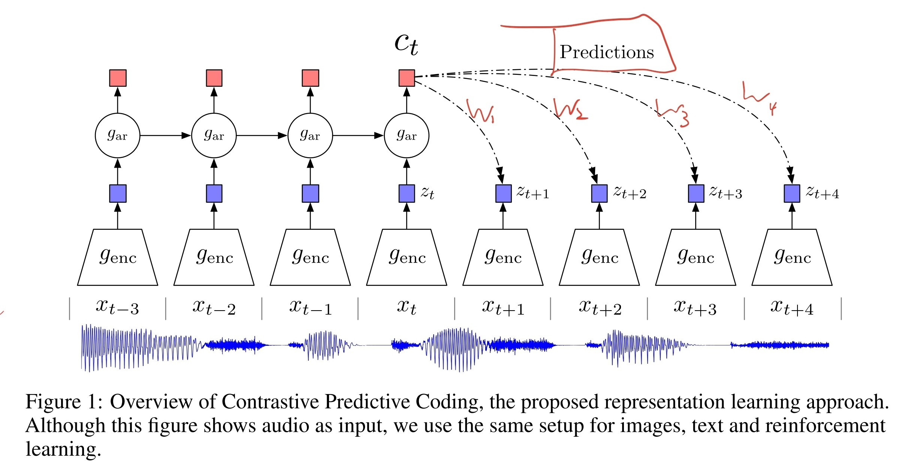
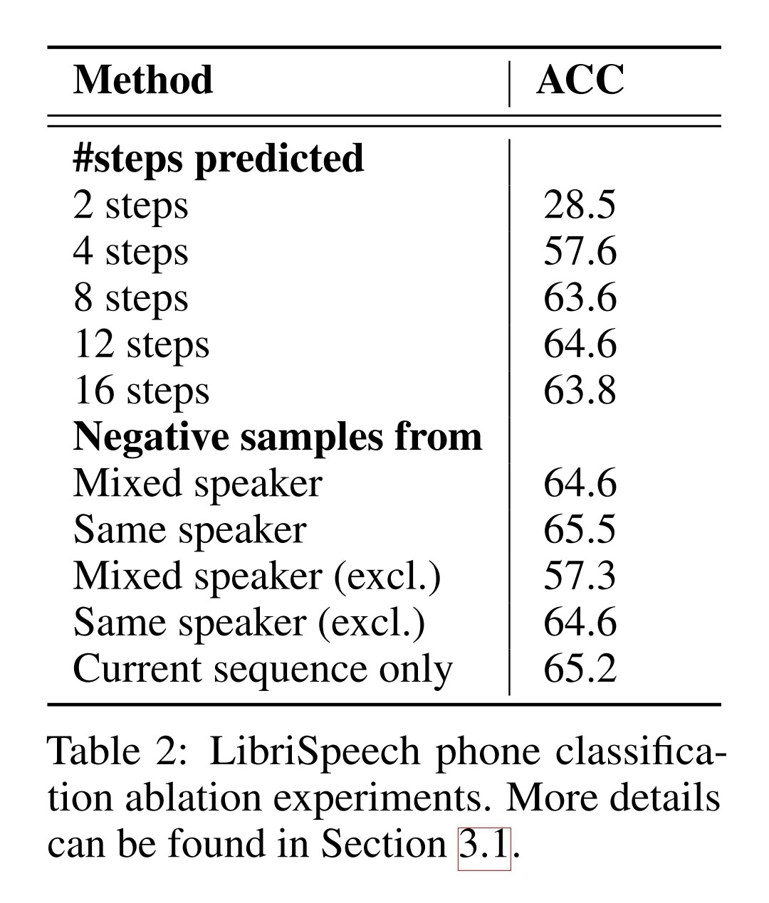

- ## Info
	- tag: #SSL
	- [Representation Learning with Contrastive Predictive Coding](https://arxiv.org/abs/1807.03748)
- {:height 440, :width 828}
	- $g_{ar}$: autoregression model, GRU RNN.
	- $g_{enc}$: a non-linear encoder $g_{enc}$ maps the input sequence of observations $x_{t}$ to a sequence of latent representations $z_{t}$, strided CNN.
- ## Loss
	- $\mathcal{L}_N=-\underset{X}{\mathbb{E}}\Bigg[log\cfrac{f_k(x_{t+k},c_t)}{\sum_{x_j\in X}f_k(x_j,c_t)}\Bigg]$
		- $f_k(x_j,c_t)=exp(z_j^{\top}W_k c_t)$
	- $X$ 是由 1 個正樣本 $x_{t+k}$ 與 $N-1$ 個負樣本組成的集合。
	- 通過 linear transformation $W_k$ 將 $c_t$ 映射至時間段 ${t+k}$（正樣本），期望能與該時間段對應的 $z_{t+k}$ 越相似越好。
- ## Experiments
  > 此處只記錄 Audio 的實驗
	- ### Dataset
		- [[LibriSpeech]] 100h 的子集
			- 使用 Kaldi toolkit 與在 LibriSpeech 上預訓練的模型 [[1](www.kaldi-asr.org/downloads/build/6/trunk/egs/librispeech/)] 取得對齊的音素標籤。
			- 拆分好的 train/test 以及音素標籤可在此取得 [[2](https://drive.google.com/drive/folders/1BhJ2umKH3whguxMwifaKtSra0TgAbtfb)]。
			- 總共有 251 名不同的語者。
	- {width 350}
		- Random initialization: $g_{enc}$ 與 $g_{ar}$ 沒有經過訓練
		- CPC 與 Supervised 都使用 $g_{ar}$ 的輸出 $c_t$ 並通過線性分類器進行預測，
			- 差別在於 CPC 是經過 SSL 預訓練後固定  $g_{enc}$ 與 $g_{ar}$ 的參數。
			- Supervised 則是直接使用監督式學習來訓練整個模型。
		- 在額外的實驗中發現，如果將 CPC 的線性分類器更改成有一個隱藏層的 MLP，就能夠將 phone classification 的正確率提升到 **72.5**
	- {width 350}
		- 從 Negative samples 的實驗中可以發現==**從與正樣本相同的句子**==（current sequence）中選取負樣本的效果非常顯著，如果將其去除（excl.）就會導致性能下降。
			- 推測是因為從 current sequence 中選取的負樣本使 SSL 的任務變得更困難，讓模型為了區分正負樣本必須學出更好的性能。
			- 相對，從其他語者挑選出來的樣本並沒有這麼難區分，因此對於提升性能沒有什麼幫助。