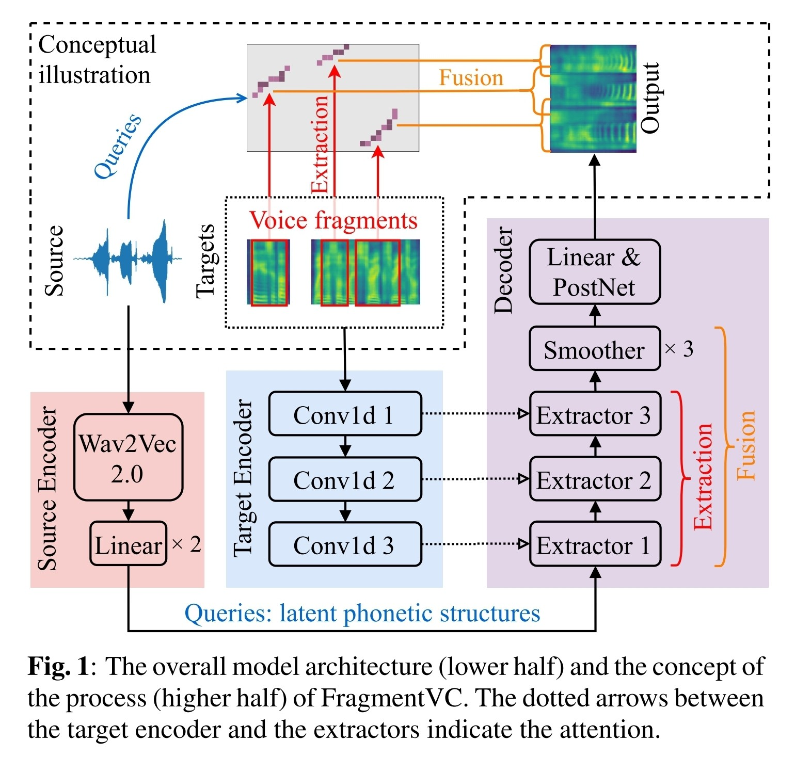
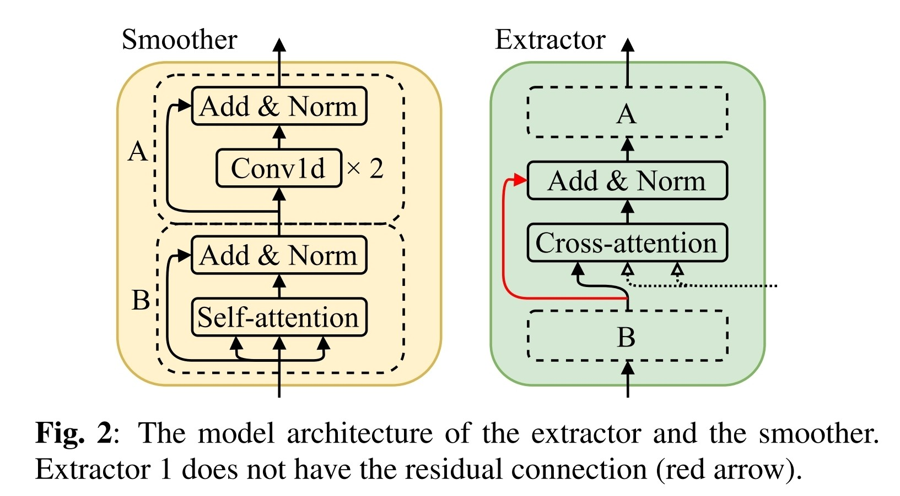
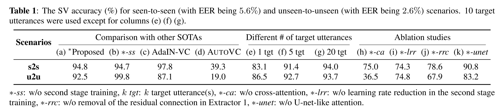
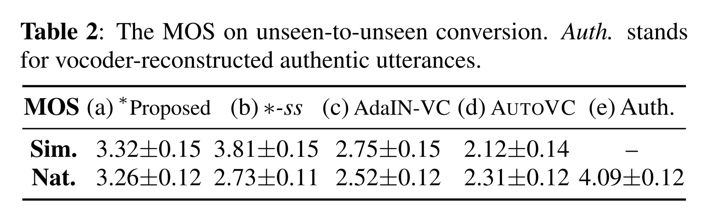

- [source link](https://www.google.com/url?sa=t&source=web&rct=j&url=https://github.com/yistLin/FragmentVC&ved=2ahUKEwiSlYTd_-H4AhU0gFYBHZbLBNcQFnoECA0QAQ&usg=AOvVaw3C6kVNoiZzY9pukk8mwcJ2)
- [paper link](https://arxiv.org/abs/2010.14150)
- {:width 600}
	- {:width 700}
		- a
	- Two-stage training
- {:width 1100}
	- **SV** speaker verification (SV)
		- https://github.com/resemble-ai/Resemblyzer
- {:width 600}
	- **Sim.** similar
	  **Nat.** natural
	- 使用了 second stage training 的方法具有比較高的語音品質
		- 但相對的其轉換後與目標語者的相似度下降了