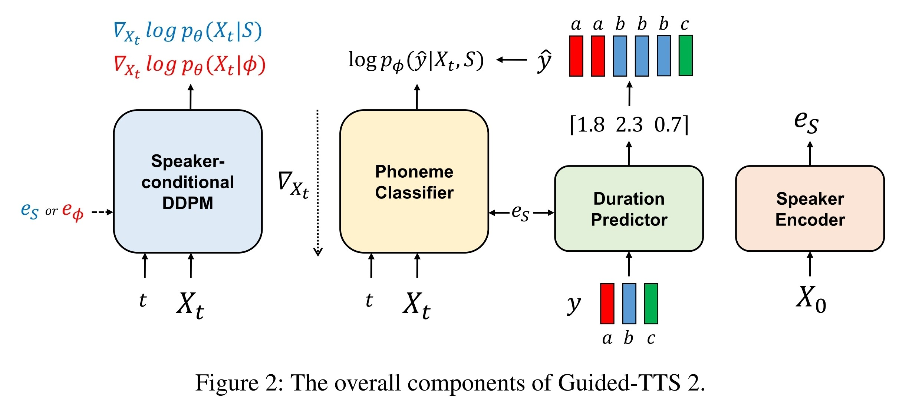
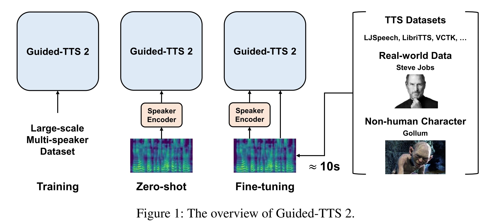
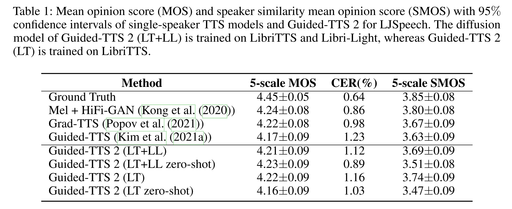
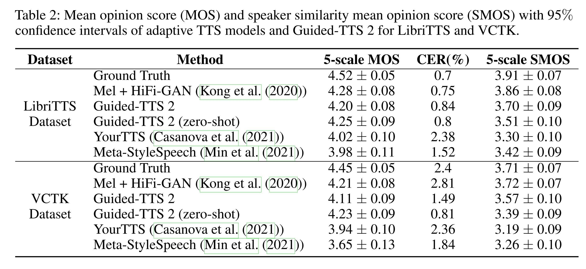
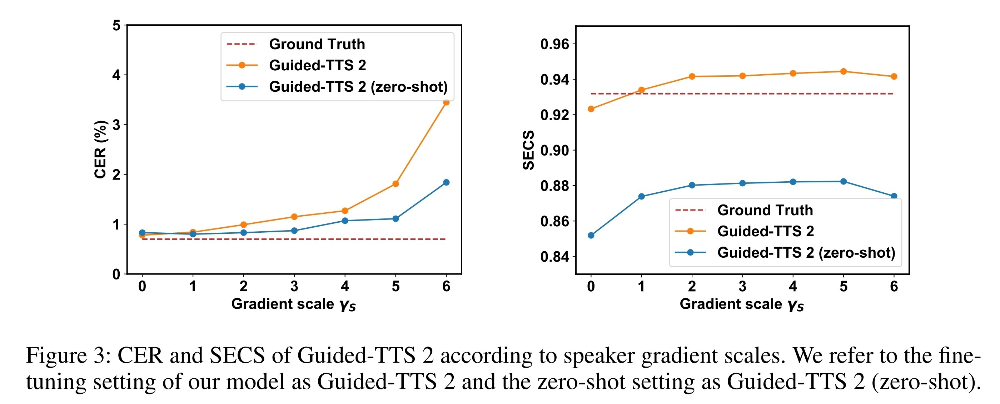

- ## Info
	- tag: #TTS #[[Diffusion-Based]] #[[Adaptive TTS]]
	- [Guided-TTS 2: A Diffusion Model for High-quality Adaptive Text-to-Speech with Untranscribed Data](https://arxiv.org/abs/2205.15370)
	- [demo](https://ksw0306.github.io/guided-tts2-demo/)
	- previous version: #[[Guided-TTS]]
- 基於 Guided TTS 的基礎下提出的 Adaptive TTS，
	- 可以使用 zero-shot 或是 fine-tune 擴展到 unseen speaker
- 
	- ### Classifier Guidance
	- ### Classifier-free Guidance
		- 參照 [Classifier-Free Diffusion Guidance](https://openreview.net/forum?id=qw8AKxfYbI) 提出的做法。
		- 在訓練時以一定的機率將 condition 移除，使單一模型同時具備了 conditional 與 unconditional 的特性。
		- 在本研究中，有 50% 的機率將 condition (由預訓練模型抽取的 speaker embedding) 更換為代表 uncondition 的 $e_{\varnothing}$。
			- $e_{\varnothing}=\cfrac{w}{||w||},~w\in\mathbb{R}^d$，$w$ 是可以訓練的參數。
- {:height 384, :width 828}
	- ### Train
		- $L(\theta)=\mathbb{E}_{t,X_0,\epsilon_t}[||s_{\theta}(X_t|S)+\lambda(t)^{-1}\epsilon_t||]$
			- $X_0$: mel-spectrogram
	- ### Zero-shot
		- 依據 [Classifier-Free Diffusion Guidance](https://openreview.net/forum?id=qw8AKxfYbI) 提出的方法計算 conditional score $\hat{s}_{\theta}(X_t|\hat{S})$
			- $\hat{s}_{\theta}(X_t|\hat{S})=s_{\theta}(X_t|\hat{S})+\gamma_{S}*(s_{\theta}(X_t|\hat{S})-s_{\theta}(X_t|\varnothing))$
	- ### Fine-tuning
		- 使用少量的目標語者資料（只需 10 秒左右）以 2e-5 的 learning rate 訓練 500 個 iterations（在 NVIDIA RTX 8000 GPU 上費時約 40 秒）
- ## Experiments
	- 
	- 
	- 