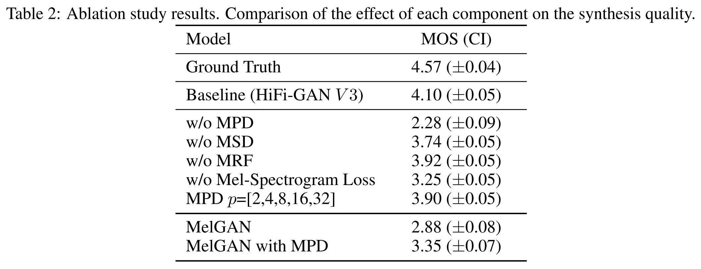

- [source link](https://github.com/jik876/hifi-gan)
- [paper link](https://daps.cs.princeton.edu/projects/HiFi-GAN/index.php?env-pairs=DAPS&speaker=f10&src-env=all)
- 快速高品質的 vocoder，並依據生成的速度、品質設計了三種不同的架構
- Multi-Receptive Field Fusion (MRF)
  collapsed:: true
	- Generator 的基本結構
	- 由多種不同感受野的 ResBlock 輸出相加為一層的 MRF
	- {:height 346, :width 774}
- Multi-Period Discriminator (MPD)
  collapsed:: true
	- 對 voice ($\in\mathbb{R}^{T}$) 使用不同 period ($p$) 執行 reshape 成 2D ($\in\mathbb{R}^{\frac{T}{p}\times p}$) 的形式後在輸入 Discriminator。
	- Discriminator 所使用的 kernal size 在 period 的部分為 1 $\Rightarrow$ Discriminator 對不連貫的樣本進行評分
	- {:width 400}
- Multi-Scale Discriminator (MSD)
  collapsed:: true
	- 對 voice 使用不同 scale (stride) 的 downsample 後在輸入 Discriminator。
	- 補足 MPD 的輸入資訊不連貫的缺失。
	- {:width 400}
- Symbol
  collapsed:: true
	- $s$: ground truth audio
	- $\tilde{s}$: $G(M_s)$, generated audio
	- $M_*$: Mel-spectorgam of $s$ or $\tilde{s}$
	- $G$: generator
	- $D_k$: k-th sub-discriminator。
		- 因為使用了 MPD 與 MSD ，而會有多個 discriminator。
- Loss
  collapsed:: true
	- Discriminator Loss ($\mathcal{L}_D$)
		- $\mathcal{L}_{advD}^{(k)}={(D_k(s)-1)}^2+{D_k(\tilde{s})}^2$
		- $\mathcal{L}_D=\sum_{k=1}^K \mathcal{L}_{advD}^{(k)}$
	- Generator Loss ($\mathcal{L}_G$)
		- GAN Loss ($\mathcal{L}_{advG}^{(k)}$)
			- ${(D(\tilde{s})-1)}^2$
		- Mel-Spectrogram Loss ($\mathcal{L}_{mel}$)
			- ${||M_s-M_{\tilde{s}}||}_1$
		- Feature Matching Loss ($\mathcal{L}_{FM}^{(k)}$)
			- $\sum_{i=1}^L \frac{1}{N_i} {||D_k^{(i)}(s)-D_k^{(i)}(\tilde{s})||}_1$
			- $D_k^{(i)}$ 表示 $D_k$ 的 i-th layer 抽取的 features，期望能讓語音在特徵的層次上相似。
			- $L$ 表示 Discriminator 的層數
		- $\mathcal{L}_G=\sum_{k=1}^K\Bigl[\mathcal{L}_{advG}^{(k)}+\lambda_{FM}\cdot\mathcal{L}_{FM}^{(k)}\Bigr]+\lambda_{mel}\cdot\mathcal{L}_{mel}$
			- $\lambda_{FM}=2$
			- $\lambda_{mel}=45$
- Experiments
  collapsed:: true
	- 
		- 依據生成品質與速度分成 V1, V2 and V3 三種版本
	- 
		- 重要性：MPD > Mel-spectrogram Loss > MSD > MRF
	- 
		- 即使是用在 unseen speaker，也具有比其他方法更高的效能。
		- Tab. 4 是將 TTS 生成的 Mel-spectorgram 作為 HiFi-GAN 的輸入並進行 fine-tune，可發現 fine-tune 後的效能提升比其他方法更顯著。