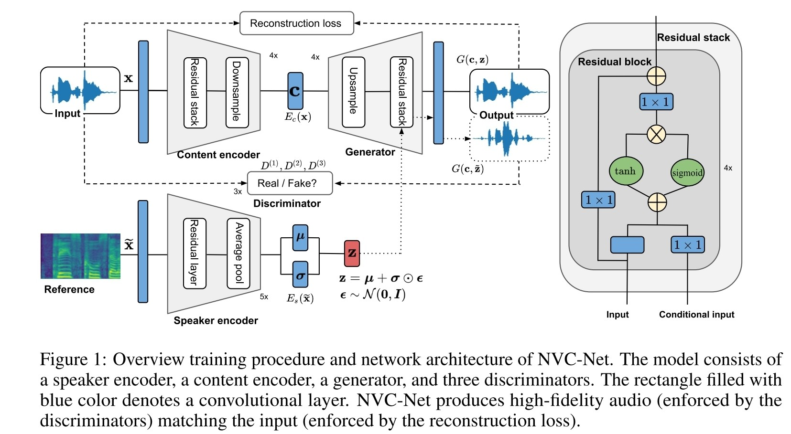
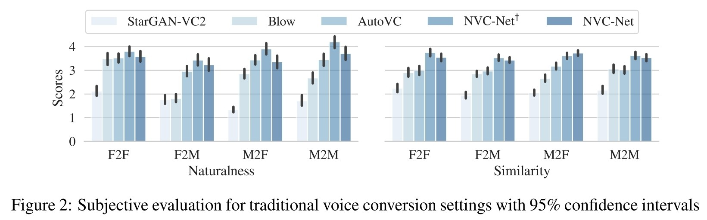
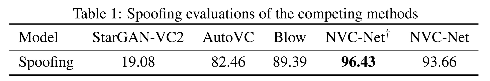
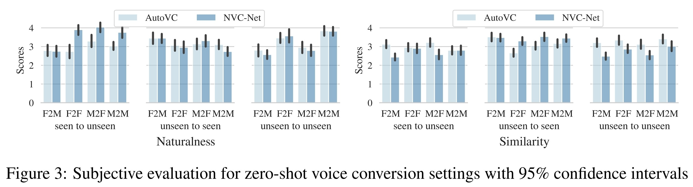
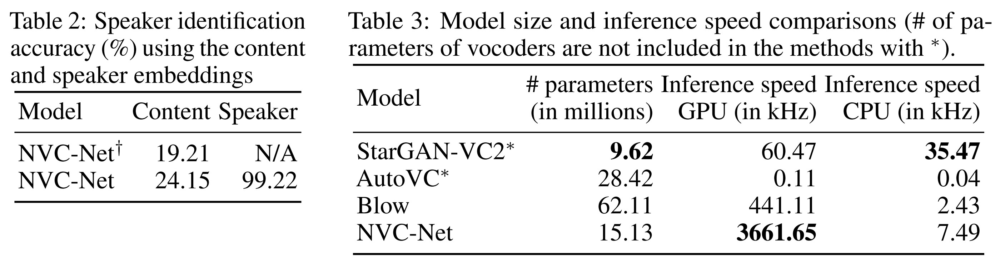
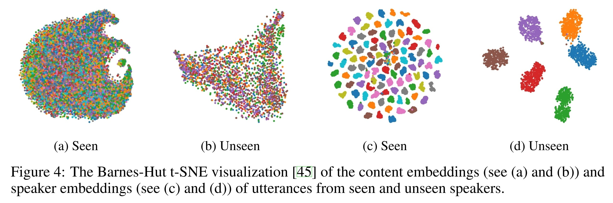

- [source link](https://github.com/sony/ai-research-code/tree/master/nvcnet)
- [paper link](https://arxiv.org/abs/2106.00992)
- #Autoencoder-Based #GAN-Based
- Design Goals
  collapsed:: true
	- reconstructing highly-perceptually-similar audio waveform from latent embeddings.
	- preserving the speaker-invariant information during the conversion.
	- generating high-fidelity audio for a target speaker.
- 
	- $D^{(k)}$: 通過 k-1 次 window size=4, stride=2 的 average pooling
		- 有三個 Discriminator 的輸入具有不同的時間解析度。
	- 不用 vocoder
	- $E_c(x)$ 取得 utterance $x$ 的 content features
	- $E_s(\tilde{x})$ 從 utterance $\tilde{x}$ 取得 speaker $\tilde{y}$ 的 speaker embedding $\tilde{z}$
- Symbol
	- $x$ 是第 $y$ 個 speaker 的語音
		- $c$ 表示 $E_c$ 從 $x$ 抽取的 content feature
	- $\tilde{x}$ 是第 $\tilde{y}$ 個 speaker 的語音
		- $\tilde{z}$ 表示 $E_s$ 從 $\tilde{x}$ 抽取的 speaker embedding
- Loss
  collapsed:: true
	- Adversarial Loss
		- 為了確保有轉換到 target speaker 的聲音，Discriminator 會判別 $Y$ 個 class, $Y$ 代表 train dataset speaker 的數量
			- 用於判斷轉換的語音是否與目標 speaker 相似
			- 而非只判斷語音是否逼真
		- k-th Discriminator $\mathcal{L}_{advD}$
			- $-\log{\{D^{(k)}(x)[y]\}}-\log{\{1-D^{(k)}(G(c,\tilde{z}))[\tilde{y}]\}}$
		- Generator $\mathcal{L}_{advG}$
			- $\sum_k \log{\{1-D^{(k)}(G(c,\tilde{z}))[\tilde{y}]\}}$
	- [[Feature Matching Loss]] $\mathcal{L}_{FM}$
	- [[Spectrogram Loss]] $\mathcal{L}_{spe}$
		- 使用 $\{2048, 1024, 512\}$ 三個不同的 FFT size 計算 Mel-spectrogram
	- Content Preservation Loss $\mathcal{L}_{con}$
		- ${||c-E_c(G(c,\tilde{z}))||}_2^2$
		- $c$ 是 $E_c$ 從原始語音 $x$ 抽取出來的 content features，$\tilde{z}$ 是 target speaker 的 embedding
		- 期望 content feature 相同 $\Rightarrow$ 語音內容不變
	- [[Speaker KL Loss]] $\mathcal{L}_{KL}$
- Experiments
	- Dataset #VCTK
	- {:height 250, :width 776}
		- NVC-Net$^{\dag}$ 使用 one hot encoder 取代原本的 speaker embeddings
	- {:height 132, :width 746}
		- Spoofing 是用 training dataset 訓練一個 speaker identification classifier，
			- 然後用這個 classifier 判斷轉換後的語音是不是 target speaker 的語音
			- 越高代表 VC 的性能越好（能成功欺騙分類器）
			- real speech 的分類正確率是 99.34%
	- 
		- [[AutoVC]] 的 speaker encoder 在有 3,549 speakers 的超大型資料集上預訓練 ([[VoxCeleb1]] + [[Librispeech]])，因此在 unseen speaker 上會具有更好的性能 (更多資料具有更高的泛化性)
	- 
		- Tab 2. 分別在 Content 與 Speaker embedding 上訓練 speaker identification classifier
			- 發現在 Content 上的分類結果不好 $\Rightarrow$ 確實有將 content 與 speaker information 分離
		- Tab 3.
			- NVC-Net 比 [[StarGAN-VC2]] 與 [[AutoVC]]（兩者皆可搭配 vocoder 使用）更快，
			- 也比同樣沒有 vocoder 的 [[Blow]] 更快更小
			- 比 [[WaveGlow]] 論文中的速度快 7x 倍
	- 
		- 不同 speaker 的 content embedding 都混在一起 $\Rightarrow$ content embedding 沒有 speaker information
		- 同個 speaker 不同 utterance 的 speaker embedding 都群去在一起，而 speaker 之間則是分隔開來 $\Rightarrow$ 有取出每個 speaker 各自的 feature