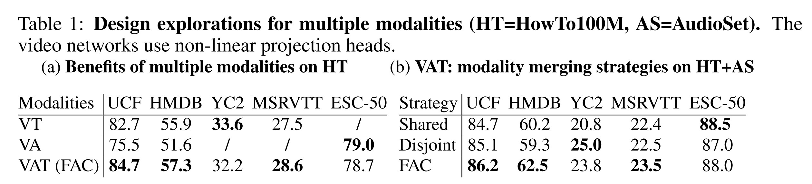
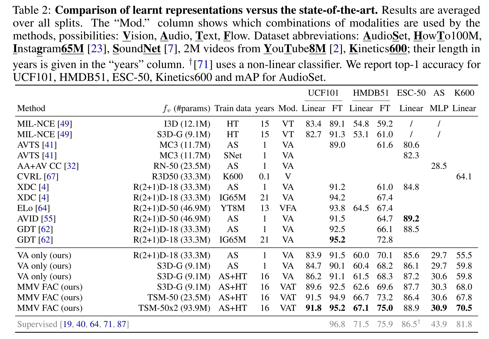
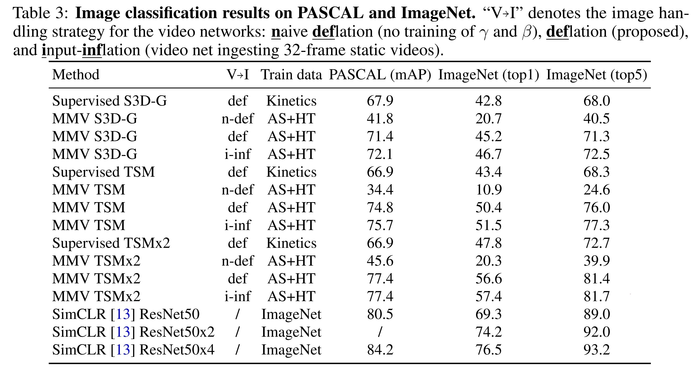

- ## Info
	- tag: #SSL
	- [Self-Supervised MultiModal Versatile Networks](https://proceedings.neurips.cc/paper/2020/hash/0060ef47b12160b9198302ebdb144dcf-Abstract.html)
	- [source link](https://github.com/deepmind/deepmind-research/tree/master/mmv)
- 
	- Loss
		- audio 與 vision 的 fearute 投影到 $va$ 空間後使用 [[NCE]]
		- 將 vision 的feature 從 $va$ 再進行一次投影到 $vat$ 空間後，
			- 與投影到相同空間的 text feature 計算 [[MIL-NCE]]
		- 疑問
			- 為何 audio 與 vision 不用 [[MIL-NCE]]
	- Video to image network deflation
		- 尚未理解
- Experiments
	- Train dataset #HowTo100M #AudioSet
	- downstream #UCF101 #HMDB51 #Kinetics600 #AudioSet #ESC-50
	- 
		- Regarding zero-shot video to text retrieval our MMV S3D-G, TSM-50 and TSM-50x2 respectively obtain a R@10 of 37.2, 41.5 and 45.4 on YouCook2 and 29.3, 31.1 and 31.1 on MSRVTT.
	- 
	- 