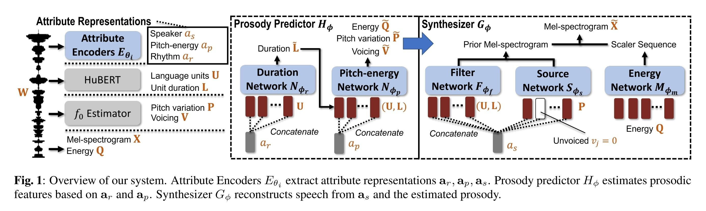

- ## Info
	- tag: #AutoEncoder-based #duration
	- [A unified one-shot prosody and speaker conversion system with self-supervised discrete speech units](https://arxiv.org/abs/2211.06535)
	- [source link](https://github.com/b04901014/uuvc)
	- [demo](https://b04901014.github.io/UUVC/)
	- previous version: #SRD-VC
- ## Intorduction
- ## Method
	- 
		- $a_i\in\mathbb{R^{d_a}},~i\in\{s,p,r\}$
		- $\mathbf{U}=(u_k\in\mathcal{U})^K_{k=1}$
		- $\mathbf{L}=(l_k\in\mathbb{N})^K_{k=1},~\sum_k l_k=J$
		- $\mathbf{P},\mathbf{V},\mathbf{\tilde{V}}\in\mathbb{R}^J$
			- $\mathbf{P}=(p_j\in\mathbb{R})^J_{j=1}$
			- $\mathbf{V}=(v_j\in\mathbb{R})^J_{j=1}$
			- $\mathbf{\tilde{V}}=(\tilde{v}_j\in\mathbb{R})^J_{j=1}$
		- $X\in\mathbb{R}^{N\times d_{mel}}$
		- $\mathbf{Q}\in\mathbb{R}^N$
		- $\mathbf{\tilde{P}},\mathbf{\tilde{Q}}\in\mathbb{R}^{J\times B}$
		- $b_i(p_j)=exp$
	- ### Joint optimization
		- 如果在開始訓練時就使用估計的 $\mathbf{\tilde{Q}}$ 與 $\mathbf{\tilde{P}}$ 作為 $G_\phi$ 的輸入，會因為估計不準確而使 $G_\phi$ 學習將其忽略，然而只使用真實的 $\mathbf{P}$, $\mathbf{Q}$ 訓練的話，又無法使 $G_\phi$ 的梯度回傳修正 $N_{\phi_p}$。
		- 為了解決這個問題，在實際訓練時將估計的 $\mathbf{\tilde{Q}}$ 與真實的 $\mathbf{P}$, $\mathbf{Q}$ 加權混合作為輸入
	- ### Loss
		- GAN loss
		- mel loss (L1 loss)
		- duration loss (MSE loss)
		- pitch bin loss (BCE loss)
		- voiced loss (BCE loss)
		- energy bin loss (BCE loss)
		- pitch & energy embedding loss (MSE loss)
	-