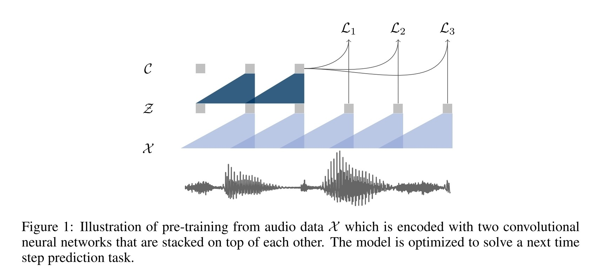

- 
	- $\mathcal{L}_k=-\sum_{i=1}^{T-k}\Big(\text{log}\,\sigma(z_{i+k}^{\top}h_k(c_i))+\underset{\tilde{z}\sim p_n}{\lambda\mathbb{E}}[\text{log}\,\sigma(-\tilde{z}^{\top}h_k(c_i))]\Big)$
		- $h_k(c_i)=W_k c_i+b_k$